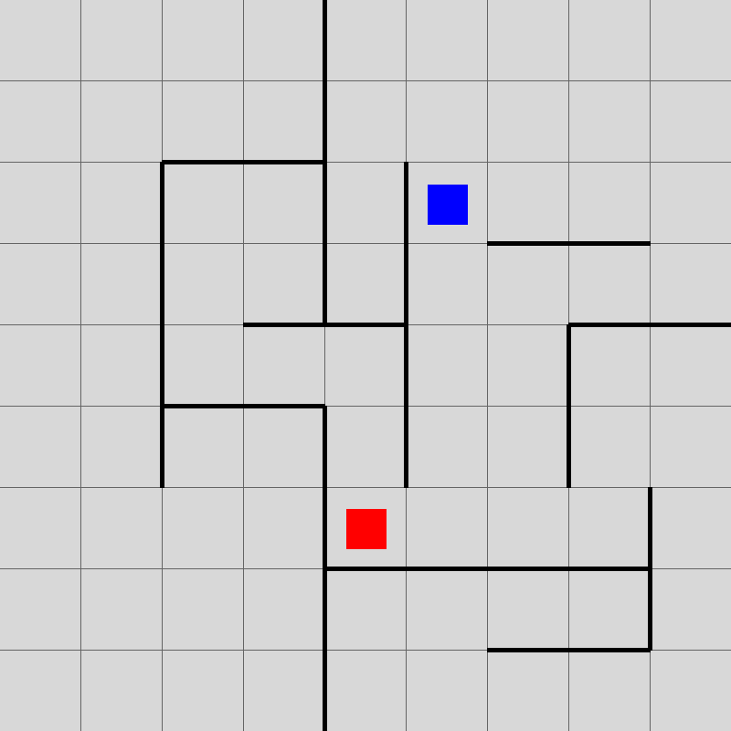

# Quoridor

A C++ implementation of the game Quoridor.

## Dependencies

* [SDL2](https://www.libsdl.org/download-2.0.php)
* [SDL2_tff](https://www.libsdl.org/projects/SDL_ttf/)
* [RapidJSON](https://github.com/Tencent/rapidjson)

## Planned Functionality

* Human player interaction
* Neural network players
* Ladder matchmaking server for bots
* Website to view games and statistics from ladder server

## License

This project is licensed under the MIT License - see the LICENSE.md file for details